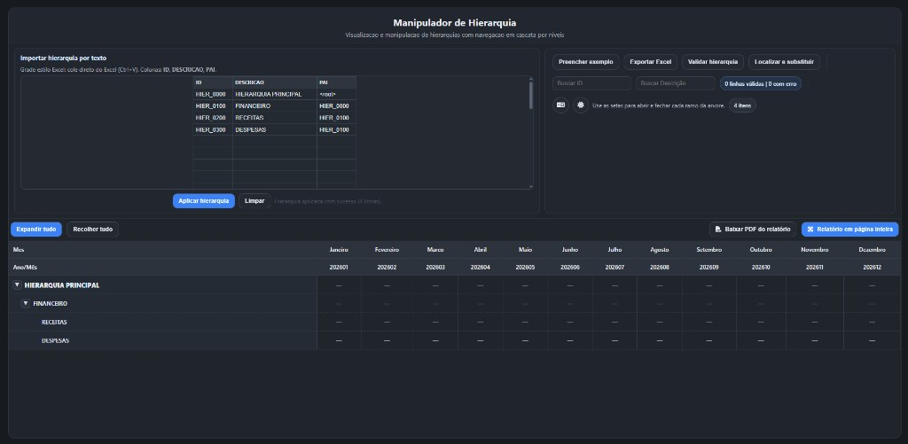

# Manipulador de Hierarquia

**Ferramenta web para hierarquias no navegador** — planilha, validação, árvore, relatório, Excel e PDF.

Ferramenta web **100% no navegador** para importar hierarquias (estilo planilha), validar relacionamentos pai–filho, navegar em árvore por níveis e visualizar um **relatório tabular** com colunas de ano/mês — com exportação para **Excel** e **PDF**, modo **página inteira** para foco no relatório, **tema claro/escuro** e interface em **português** ou **inglês**.

> **English (short):** Single-page app to paste hierarchies from Excel, expand/collapse tree branches, validate parents, export hierarchy to `.xlsx` and a visual snapshot of the report to `.pdf`, with light/dark theme and PT/EN UI.

*Captura: tema escuro com hierarquia de exemplo aplicada.*

---

## Sumário

| | |
|:---|:---|
| [Funcionalidades](#funcionalidades) | Importação, validação, relatório, tema, exportação |
| [Fluxo de uso rápido](#fluxo-de-uso-rápido) | Passos essenciais |
| [Formato da grade](#formato-da-grade-id-descrição-pai) | Colunas ID, DESCRICAO, PAI |
| [Relatório na tabela](#relatório-na-tabela) | Meses e árvore |
| [Créditos](#créditos) | Sobre o projeto |

---

## Funcionalidades

### Importação e edição

- **Grade estilo Excel** com colunas **ID**, **DESCRICAO** e **PAI**.
- **Colar direto do Excel** (Ctrl+V) na grade.
- Botões **Aplicar hierarquia** (monta a árvore e o relatório) e **Limpar**.
- **Preencher exemplo** com uma hierarquia mínima para testes.
- **Desfazer** alterações na grade com **Ctrl+Z** (Windows/Linux) ou **Cmd+Z** (macOS).
- **Ctrl+C / Ctrl+X** na grade com cópia/recorte para a área de transferência.

### Validação e busca

- **Validar hierarquia**: abre modal com resumo (total, válidas, com erro) e lista de problemas (ex.: pai inexistente).
- **Buscar ID** e **Buscar descrição**: filtram linhas do relatório mantendo contexto dos níveis superiores visíveis.
- **Localizar e substituir** em IDs e/ou descrições.
- Indicador de **linhas válidas | com erro** na grade.

### Visualização do relatório

- Tabela com **duas linhas de cabeçalho** (mês por extenso e ano/mês) e primeira coluna com **árvore expansível** (setas para abrir/fechar ramos).
- **Expandir tudo** / **Recolher tudo** na barra imediatamente acima da tabela.
- **Relatório em página inteira**: ocupa a área da aba; esconde cabeçalho, importação e toolbar superior; **Esc** volta ao modo normal.
- Contador de **itens** na árvore.

### Aparência e idioma

- **Tema claro / escuro** (ícone lua/sol), preferência salva no navegador.
- **Português / inglês** (ícone de idioma).

### Exportação

- **Exportar Excel** (`.xlsx`) da hierarquia atual (grade ou dados aplicados).
- **Baixar PDF do relatório**: captura visual da área da tabela, **A4 paisagem**, várias páginas se necessário.

---

## Fluxo de uso rápido

1. Cole na grade os dados (ID, DESCRICAO, PAI) ou clique em **Preencher exemplo**.
2. Clique em **Aplicar hierarquia**.
3. Use as setas na primeira coluna do relatório para expandir/recolher níveis.
4. (Opcional) **Validar hierarquia**, **Exportar Excel** ou **Baixar PDF do relatório**.
5. (Opcional) **Relatório em página inteira** para apresentar só a tabela; **Esc** para sair.

---

## Formato da grade (ID, descrição, pai)

| Coluna | Significado |
|--------|-------------|
| **ID** | Identificador único do nó. |
| **DESCRICAO** | Texto exibido na árvore. |
| **PAI** | ID do pai; vazio ou valor sentinela de raiz conforme seus dados (o exemplo usa hierarquia com raiz explícita). |

Erros comuns detectados na validação: **PAI** referenciando um ID que não existe na lista.

---

## Relatório na tabela

- Colunas de valores são geradas para os **12 meses do ano corrente** (formato ano+mês no cabeçalho).
- A coluna indicadores mostra a **hierarquia indentada** com controles de expandir/recolher.
- Filtros de busca reduzem as linhas visíveis sem perder a cadeia de ancestrais necessária para contexto.

---

## Créditos

**Manipulador de Hierarquia** — modelagem e visualização de hierarquias para fluxos de trabalho e aprovação com gestores (Excel + PDF).

Se este README ajudou, considere dar uma estrela no repositório.
